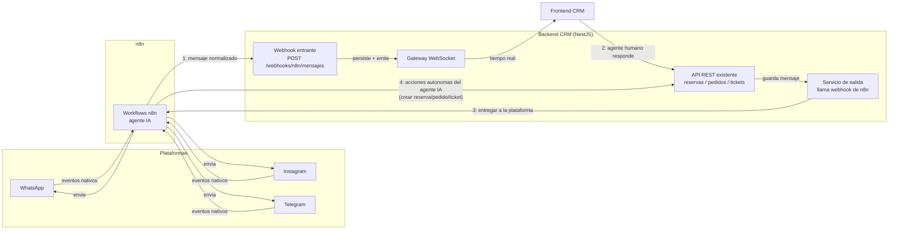

# Plan: módulo de Mensajes/Conversaciones (webhooks n8n + WebSocket)

Estado: **planificación, sin implementar**. Este documento define la arquitectura antes de tocar código, porque a diferencia de los módulos anteriores (usuarios, productos, clientes, reservas, tickets, pedidos) este no es un CRUD aislado: tiene que sincronizarse en tiempo real con un agente externo (n8n) que a su vez habla con WhatsApp/Instagram/Telegram, y ese mismo agente necesita poder ejecutar acciones de negocio (crear reservas, pedidos, tickets) contra nuestra API.

## 1. Lo que ya existe en el modelo (no hay que migrar nada)

`conversaciones`:
- `cliente_id` (nullable — puede llegar un mensaje de alguien que todavía no es un `Cliente` registrado)
- `canal` (`telegram` | `whatsapp` | `instagram`)
- `canal_chat_id` (el id del chat/hilo en la plataforma origen)
- `ticket_id` (nullable — la conversación puede escalar a un ticket)
- `estado` (`abierta` | `cerrada` | `archivada`)
- `ultimo_mensaje_at`
- `UNIQUE(canal, canal_chat_id)` → esta es la clave natural para upsert de conversación

`mensajes`:
- `conversacion_id`
- `canal_mensaje_id` (nullable, único parcial) → **deduplicación gratis**: si n8n reintenta una entrega o la plataforma reenvía el mismo evento, un upsert por este campo evita mensajes duplicados sin que tengamos que inventar lógica de idempotencia
- `remitente` (`cliente` | `agente` | `sistema`)
- `enviado_por_usuario_id` (nullable) → **este campo ya resuelve una ambigüedad importante**: `remitente='agente'` cubre tanto al bot de IA como a un humano del equipo respondiendo manualmente; `enviado_por_usuario_id = NULL` significa que respondió el bot, y si tiene un id, fue ese usuario humano. No hace falta agregar nada al esquema para esto.
- `tipo_contenido`, `contenido`, `url_adjunto`, `metadata` (JSONB, con índice GIN — sirve para guardar el payload crudo del webhook, botones, ubicación, reply-to, etc.)

## 2. Los cuatro flujos de datos



**Flujo 1 — mensaje entrante (cliente → CRM).** n8n recibe el evento nativo de cada plataforma, lo normaliza a un formato único y lo postea a nuestro webhook. El backend hace upsert de `Conversacion` por `(canal, canal_chat_id)`, crea el `Mensaje` (dedup por `canal_mensaje_id`), actualiza `ultimo_mensaje_at`, y emite el evento por WebSocket a los agentes conectados.

**Flujo 2 — respuesta humana (CRM → cliente).** Un agente del equipo escribe una respuesta desde el frontend del CRM. Esto pega a un endpoint autenticado normal (JWT), que guarda el `Mensaje` (`remitente='agente'`, `enviadoPorUsuarioId` = el usuario) y dispara la entrega real llamando a un webhook de n8n (ver flujo 3).

**Flujo 3 — entrega saliente (CRM → n8n → plataforma).** El backend NO tiene credenciales de WhatsApp/Instagram/Telegram — esas viven en n8n. Así que para que un mensaje salga de verdad, el backend llama a un webhook expuesto por n8n (`N8N_OUTBOUND_WEBHOOK_URL`) pasándole `canal`, `canalChatId` y el contenido. n8n hace el envío real a la plataforma.

**Flujo 4 — acciones autónomas del agente IA.** Cuando el agente de n8n decide (sin intervención humana) crear una reserva, un pedido, o abrir/actualizar un ticket para atender al cliente, necesita llamar a nuestra API. Esto es la pregunta que planteaste — la resuelvo en la sección 3.

## 3. Cómo autentica el agente contra la API (tu pregunta central)

El agente de n8n no es un usuario humano: no tiene contraseña, no debería pasar por `/auth/login`, y mantener vivo un JWT de acceso de 1h con refresh es fricción innecesaria para un proceso automatizado que corre 24/7.

### Opción evaluada A — JWT de una cuenta de servicio
n8n almacena credenciales de un `Usuario` especial y hace login como cualquier cliente, renovando el `refreshToken` periódicamente.
- ✅ Reutiliza 100% el pipeline de auth existente sin escribir nada nuevo.
- ❌ Hay que resolver la renovación del token en n8n (workflow adicional solo para eso), y si el token expira a mitad de una ejecución del agente, la acción falla.
- ❌ Le da al agente, en la práctica, el mismo nivel de acceso que un usuario humano con ese rol — no hay una frontera clara entre "lo que puede hacer un agente automatizado" y "lo que puede hacer un vendedor".

### Opción evaluada B — Endpoints dedicados para el agente, autenticados con API key estática (recomendada)
Un módulo nuevo (`AgentModule` / `WebhooksModule`) con un puñado de endpoints explícitos — no el CRUD completo — que representan exactamente las acciones que el agente puede tomar:

```
POST /webhooks/n8n/mensajes          (flujo 1, mensaje entrante)
POST /webhooks/n8n/reservas          (crear reserva)
POST /webhooks/n8n/pedidos           (crear pedido)
POST /webhooks/n8n/tickets           (crear/actualizar ticket)
```

Autenticados con un header estático (`X-Agent-Api-Key`, comparado contra `AGENT_API_KEY` en `.env`) mediante un `AgentApiKeyGuard` propio — **no pasan por `AuthMiddleware` ni por JWT en absoluto**. Por dentro, cada endpoint delega directo a los `Service` que ya existen (`BookingService.create`, `OrderService.create`, `TicketsService.create`) — cero lógica de negocio duplicada.

Para que `creadoPor` / `usuarioId` / `asignadoA` sigan teniendo un valor coherente (esas columnas son `INT REFERENCES usuarios`), sembramos un `Usuario` de sistema fijo (p. ej. `agente-ia@sistema.local`, `estado='activo'`) y el controller usa ese id fijo (vía env var, mismo patrón que `ADMIN_ROLE_ID`) en vez de leerlo de un JWT. Así en la base queda clarísimo qué reservas/pedidos/tickets creó el bot vs. un humano, sin que el bot necesite loguearse nunca.

- ✅ Sin manejo de expiración/refresh — una sola clave estática, rotable manualmente.
- ✅ Superficie de acción explícita y auditable: el agente solo puede pegarle a 4 rutas, no a los 20 endpoints humanos.
- ✅ Reutiliza toda la capa `Service`/`Repository` ya construida.
- ❌ Requiere un guard nuevo y mantener la clave sincronizada entre `.env` del backend y las credenciales guardadas en n8n.
- ⚠️ Una API key estática es más débil que HMAC por request si el `.env` del backend o la config de n8n se filtran — mitigable después con firma HMAC (`X-Signature`) si hace falta más adelante; no es necesario para la primera versión.

**Recomendación: Opción B.** Resuelve exactamente el problema que describiste ("el agente no tendría temas de JWT") y de paso reduce el blast radius de un secreto comprometido comparado con darle al agente un usuario con rol completo.

## 4. WebSocket al frontend (no por el mismo webhook)

Un webhook es una llamada HTTP que **alguien más** te hace a vos — el navegador del agente humano no puede exponer un endpoint HTTP para que el backend lo llame. Por eso el frontend necesariamente usa WebSocket (o un mecanismo push equivalente, como Server-Sent Events), nunca un webhook. La separación queda así:

- **n8n ↔ backend:** HTTP webhooks en ambas direcciones (servidor a servidor).
- **backend → navegador del agente:** WebSocket (`@nestjs/websockets` + `socket.io`, ya que el resto del stack es NestJS/Express).

Diseño del gateway:
- Autenticación en el handshake: el cliente manda el JWT igual que en las rutas REST; el gateway lo valida reutilizando `AuthService.validateToken` (ya existe, no hay que reimplementar verificación).
- Salas (`rooms`) por `conversacionId`, más una sala global `inbox` para la lista de conversaciones activas.
- Eventos: `mensaje:nuevo`, `conversacion:actualizada` (para reflejar cambios de `estado`/`ultimo_mensaje_at` en la lista sin recargar).

## 5. Endpoints nuevos a construir (además del CRUD base de mensajes/conversaciones)

| Endpoint | Auth | Qué hace |
|---|---|---|
| `GET /conversaciones`, `GET /conversaciones/:id`, `PATCH /conversaciones/:id` | JWT humano | listar/ver/archivar conversaciones — CRUD base como los demás módulos |
| `GET /conversaciones/:id/mensajes` | JWT humano | historial paginado de una conversación |
| `POST /conversaciones/:id/mensajes` | JWT humano | un agente humano responde (flujo 2) → dispara flujo 3 |
| `POST /webhooks/n8n/mensajes` | API key | mensaje entrante desde cualquier canal (flujo 1) |
| `POST /webhooks/n8n/reservas` `/pedidos` `/tickets` | API key | acciones autónomas del agente IA (flujo 4) |

## 6. Seguridad y robustez

- **Rate limiting:** ya existe `ThrottlerGuard` en el proyecto — aplicarlo también a las rutas de webhook (más agresivo que en rutas humanas, ya que n8n puede reintentar).
- **Idempotencia:** ya resuelta por el índice único parcial de `canal_mensaje_id` — al insertar, usar `upsert`/capturar `P2002` en vez de fallar con 500.
- **Excluir del `AuthMiddleware` global:** las rutas `/webhooks/n8n/*` deben sumarse a la lista de `exclude()` en `app.module.ts` (igual que ya se hizo con `/auth/login`), porque no traen JWT.
- **Vinculación cliente ↔ conversación:** cuando llega un mensaje de un `canal_chat_id` nuevo, ¿cómo sabemos si corresponde a un `Cliente` ya existente? No hay una respuesta obvia desde el modelo actual (no hay un campo tipo `telefono` normalizado para cruzar con WhatsApp). Lo dejo como pregunta abierta en la sección 8.

## 7. Fases de implementación

1. ✅ **CRUD base de `conversaciones`/`mensajes`** + `POST /webhooks/n8n/mensajes` con `AgentApiKeyGuard`.
2. ✅ **Gateway WebSocket** (`src/api/messages/messages.gateway.ts`) + emisión de eventos desde el webhook entrante.
3. ✅ **Flujo de salida:** `POST /conversaciones/:id/mensajes` (humano) llama a `N8nOutboundService.enviarAPlataforma()`, que hace `fetch` al `N8N_OUTBOUND_WEBHOOK_URL`. Ver sección 9 para el contrato.
4. ✅ **Endpoints de acciones del agente** (`/webhooks/n8n/reservas` `/pedidos` `/tickets`), reutilizando los `Service` existentes + el usuario de sistema sembrado (`agente-ia@sistema.local`).

Las cuatro fases están implementadas y verificadas manualmente (incluyendo el caso de n8n caído/no configurado, que degrada a `entregado: false` sin romper la request).

## 8. Decisiones tomadas

1. **API key estática (Opción B)** confirmada para el agente.
2. **Vinculación `Cliente` ↔ conversación nueva:** sigue abierta — por ahora `clienteId` es opcional en `POST /webhooks/n8n/mensajes`; si n8n ya lo identificó, lo manda; si no, la conversación queda con `clienteId: null` hasta que un humano la asocie manualmente vía `PATCH /conversaciones/:id`.
3. **URL del webhook de salida de n8n:** todavía no definida del lado de n8n — el backend ya está listo (`N8N_OUTBOUND_WEBHOOK_URL` en `.env`, vacío por defecto). Falta que definan ese workflow y peguen la URL real.
4. **Workflow único vs. uno por canal en n8n:** sin definir, no afecta al backend.
5. **Alcance de "seguimiento" del agente:** sin definir — por ahora el agente puede crear/actualizar `Ticket` vía `/webhooks/n8n/tickets`, que es el único concepto de seguimiento que sobrevive en el modelo actual.

## 9. Contrato del webhook de salida (CRM → n8n)

El backend hace `POST` al `N8N_OUTBOUND_WEBHOOK_URL` configurado, con este body cuando un humano responde desde el CRM:

```json
{
  "canal": "whatsapp",
  "canalChatId": "5215551234",
  "tipoContenido": "texto",
  "contenido": "Claro, contame que necesitas",
  "urlAdjunto": null,
  "mensajeId": 42
}
```

Header opcional `X-Outbound-Api-Key` (valor de `N8N_OUTBOUND_API_KEY`) si el workflow de n8n exige autenticación en el webhook receptor. El workflow de n8n debe usar `canal` + `canalChatId` para saber a qué chat de qué plataforma entregar `contenido`/`urlAdjunto`.

Comportamiento del backend ante fallas: timeout de 5s, cualquier error de red o respuesta no-2xx se loguea (`N8nOutboundService`) pero **nunca** hace fallar la request HTTP que originó el mensaje — el mensaje ya quedó persistido y emitido por WebSocket antes de intentar la entrega. La respuesta de `POST /conversaciones/:id/mensajes` incluye `"entregado": true|false` para que el frontend pueda avisar si la entrega real a la plataforma falló.
